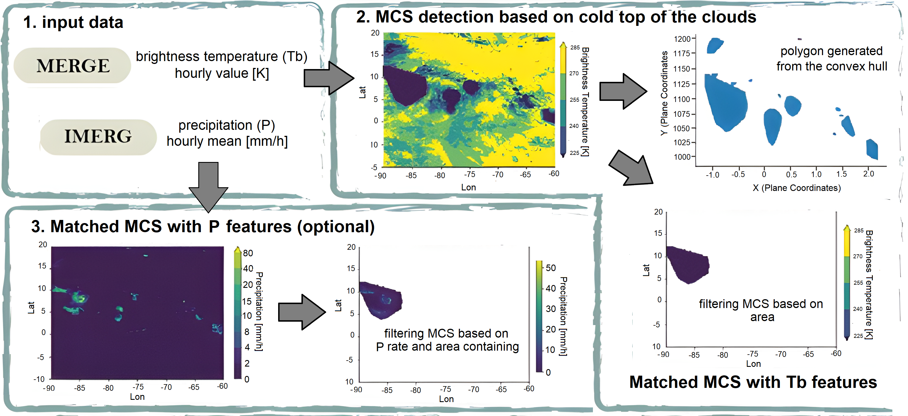
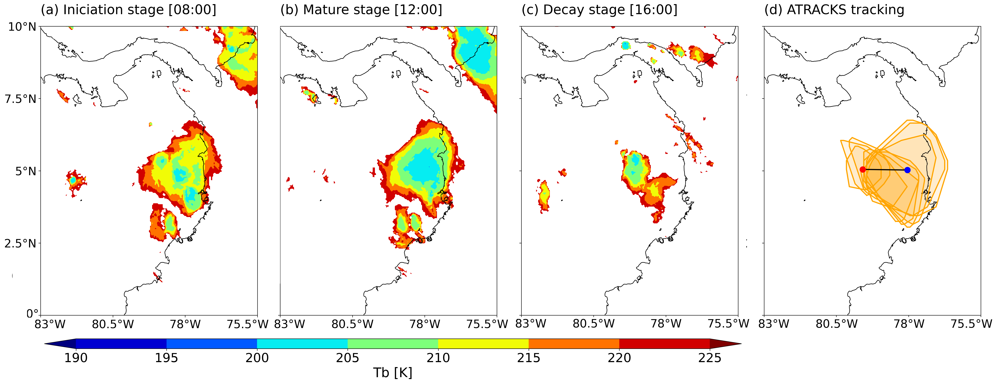

[](https://doi.org/10.5281/zenodo.17388137)


## Introduction

The Algorithm for TRACKing Convective Systems (ATRACKCS, Robledo et al., 2024) is a free and open source Python package for the automated detection and tracking of convective systems, with a special focus on Mesoscale Convective Systems (MCS). MCS are organized cloud clusters that produce regional rainfall and feature vertical development penetrating the mid-upper troposphere. The spatio-temporal characterization of MCS contributed to reducing the vulnerability to severe precipitation events, as well as understanding weather and regional climate. This Python package is a tool for characterizing spatio-temporal distribution and evolution of MCS and is intended for researchers and students interested in exploring MCS dynamics. 

ATRACKCS provides a set of functions designed for a workflow analysis that includes the detection and tracking of MCS, allowing detailed monitoring of the MCS life cycle both in space and time. The algorithm uses brightness temperature (Tb) and precipitation (P) coming from public satellite data. To represent the identified systems, ATRACKCS uses the convex hull to simplify its shape as polygons.
The algorithm parameterization can be adapted to the needs of the MCS detection, as the user is allowed to define the thresholds of Tb, P area of the events and minimum duration. 

In version 2.0.0, we change the structure of ATRACKCS to improve speed of processing and thus, facilitate the tracking at global scale. We include multiprocessing features to track multiple systems at the same time using both Tb and P. Aditionally, detection of cold clouds was improved by preprocessing the image of Tb and merge close clusters into a single entity, this proved to improve ATRACKCS ability to track more complex systems as tropical cyclones and improve the duration of the tracked events. To deal with the splitting and merging of systems, if multiple systems overlap at the same timestep, ATRACKCS evaluates which systems satisfy the identification criteria and then selects the one with the higher overlapping area to the previous time step to continue the track; the remaining systems are tracked as new ones if satisfy the thresholds. 

-----
## ATRACKCS Installation and Usage Guide

#### 1. ATRACKCS Environment Setup
ATRACKCS relies on geospatial libraries like `geopandas` and `rioxarray`, which are best managed using the Conda package manager.

**1.1: Clone the Repository**

Open your terminal and clone the ATRACKCS source code from GitHub:

```bash
git clone https://github.com/ATRACKCS/ATRACKCS.git
cd ATRACKCS
```

**1.2 Create the Conda Environment**
Use the provided `atrackcs_env.yml` file to create a dedicated Conda environment named atrackcs.

```bash
conda env create -f atrackcs_env.yml
```

**1.3: Activate the Environment**
Once created, activate the environment. All subsequent steps must be executed with this environment active.

```bash
conda activate atrackcs
```

**1.3: Install ATRACKCS package**
Ensure you are in the project's root directory (`ATRACKCS/`), where the `setup.py` file is located.

```bash
(atrackcs) $ pip install -e .
```
The message `Successfully installed atrackcs-2.0.0` confirms the installation was successful.

**1.4: Verification**

Open a Python interpreter or a test script **within the `atrackcs` environment** and test the main import:

```bash
(atrackcs) $ python
>>> from atrackcs import ATRACKCSConfig
```
If nothing prints out, installation is successful. 

#### 2. Usage 

The repository provides a Jupyter Notebook and sample data to help you quickly understand and verify the ATRACKCS functionality.

**2.1. Example Files**

| File Name | Description |
| :--- | :--- |
| **`Example_ATRACKCS.ipynb`** | **Complete Pipeline Run.** This notebook demonstrates the three core steps (`read_identify_mcs_parallel`, `finder_msc`, `resume_track`) necessary to run a full storm tracking pipeline. It walks through loading the configuration, executing the identification of events, processing, and generating the final summary tables. |
| **`Plot_ATRACKCS.ipynb`** | **Result Verification.** Use this notebook to load the final output CSVs (generated by the `resume_track` function) and visualize the identified tracks on a map. This is essential for verifying the results of your tracking run. |

**2.2. Sample Data for Testing**
To allow immediate testing after installation, the repository includes a small set of data:

| Location | Contents | Tracking Period |
| :--- | :--- | :--- |
| **`tests/WA/tb/`** | Brightness Temperature (Tb) NetCDF files. | **4 Days:** August 1st to August 4th, 2016 |
| **`tests/WA/p/`** | Precipitation (P) NetCDF files. | West Africa Region |

This sample data covers a **4-day period (20160801 - 20160804)** over the **West Africa (WA) region** and is designed to provide a quick, fully working demonstration of the ATRACKCS pipeline.

-----

### 3. Technical Details 

#### 3.1. Running ATRACKCS

The storm detection, tracking and characterization is divided in 3 main process:

**1. Storm Identification:** 

The storm identification component selects MCS candidates from the input data. The function to perform this is:

```python
from atrackcs import ATRACKCSConfig
from atrackcs import read_identify_mcs_parallel

my_config = ATRACKCSConfig()

read_identify_mcs_parallel(path_tb, path_p, path_results, my_config)

```
path_tb = Path of the Tb data folder.
path_p = Path of the Tb data folder.
path_results = Path to store intermediate files and final results.
my_config: import ATRACKCS config file.

This function perform the following steps: 

1. Tb and P area processed to match IMERG v07's spatial resolution ($\mathbf{0.1^\circ}$) and 1hr temporal resolution. At a every time step, the algorithm finds all pixels where `Tb <= TB_VALUE [200 k, 241 k]` and defines approximate regions with the convex hull. The `TB_OVERSHOOT` is == True if the system has a overshooting inside the area selected.

2. Compute the approximate area of the defined region, discard all regions where area is `<= AREA_VALUE [km^2]`.

3. Estimate P attributes of identified systems. If `DROP_EMPTY_PRECIPITATION = True` discard regions if the polygons do not contain at least 5 pixels with `precipitation rates >= PP_RATES`. If `DROP_EMPTY_PRECIPITATION = False`, calculate P characteristics and keep all the polygons identified in the previous step.



The `read_identify_mcs_parallel` function generated the intermediate .pkl file containing all the storms candidates.

**2. Storm Tracking:**

Tracks convective systems based on polygon overlap percentage.

```python
from atrackcs import ATRACKCSConfig
from atrackcs import finder_msc

my_config = ATRACKCSConfig()

tracked_storms = finder_msc(path_results, my_config)

```

**Overlapping priority principle:** for any MCS at time t, the MCS with the highest overlap percentage at time `t+1` "wins" and is associated with it. If there are MCS with lower overlap percentages, they are left to be associated in the next iteration and form a track on their own.
No merging or splitting is allowed, any MCS at time t can only be linked to one MCS at time `t+1`. Similarly, any MCS at time `t+1` can only be linked to one MCS at time `t`. All tracks that do not get updated during the `t` - `t+1` process terminate. 

**3. Features and Summary:** 

Estimate MCS and tracks attributes. The `resume_track` function filters tracks based on the minimum `DURATION`, calculates summary features, and saves the final output to a CSV file in `path_results`.

```python
from atrackcs import ATRACKCSConfig
from atrackcs import resume_track

my_config = ATRACKCSConfig()

final_summary = resume_track(tracked_storms, path_results, my_config)

```

**ATRACKCS Output Data Dictionary**

| Field Name | Data Type | Units | Description |
| :--- | :--- | :--- | :--- |
| **`track_id`** | String | N/A | **Unique Identifier for the Storm Track.** This ID remains constant for all polygons belonging to the same continuous system. |
| **`polygon_id`** | String | N/A | **Unique Identifier for the Storm Snapshot (Spot).** A unique ID for the polygon at a specific time step. |
| **`time`** | Datetime | UTC | Timestamp marking the time of the observation/snapshot. |
| **`geometry`** | GeoPandas Polygon | Degrees | The geospatial boundary of the identified storm shield (cold cloud) at the specific time step. |
| **`area_tb`** | Float | $\text{km}^2$ | **Cold Cloud Shield Area.** The total area of the storm's cold cloud shield ($\text{e.g., Tb} \leq 241\text{ K}$) calculated using a projected CRS. |
| **`tb_overshoot`** | **Boolean** | N/A | **Deep Convection Flag.** `True` if the storm system contains at least five pixels with a Brightness Temperature (Tb) colder than the defined **`TB_OVERSHOOT`** threshold ($\text{e.g., } \leq 225\text{ K}$). |
| **`pp_10rate`** | Boolean | N/A | **Heavy Precipitation Flag.** `True` if the storm system contains at least one pixel with a precipitation rate greater than or equal to $10 \text{ mm/h}$. |
| **`volum_pp`** | Float | $\text{m}^3/\text{h}$ | **Total Rain Volume/Flux.** The total integrated volume of precipitation over the storm area per hour. |
| **`mean_pp`** | Float | $\text{mm/h}$ | **Mean Precipitation Rate.** The mean precipitation rate calculated over all precipitating pixels within the storm's cloud shield boundary. |
| **`mean_pp_above_rate`**| Float | $\text{mm/h}$ | **Mean Rate Above Threshold.** The mean precipitation rate calculated only for pixels where precipitation exceeds `PP_RATES` (e.g., $2 \text{ mm/h}$). |
| **`hvy_prec_frac`** | Float | Ratio | **Heavy Precipitation Fraction.** The ratio of the area covered by heavy precipitation (e.g., $\text{P} \geq 10 \text{ mm/h}$) to the total precipitating area ($\text{P} \geq 2 \text{ mm/h}$). |
| **`centroids`** | GeoPandas Point | Degrees | The geographical center point (representative point) of the storm shield polygon, used for tracking calculations. |
| **`distance_c`** | Float | $\text{km}$ | **Distance Traveled (Per Step).** The distance the storm centroid traveled between the current time step ($t$) and the previous time step ($t-1$). |
| **`direction`** | Float | Degrees | **Direction of Movement.** The bearing (angle from North, $0^{\circ} - 360^{\circ}$) of the storm centroid movement between $t-1$ and $t$. |
| **`u`** | Float |  | **Zonal Velocity Component.** The eastward component of the storm's velocity vector, derived from the centroid displacement. |
| **`v`** | Float |  | **Meridional Velocity Component.** The northward component of the storm's velocity vector, derived from the centroid displacement. |
| **`total_duration`** | Integer | Hours | **Total Track Lifetime.** The total number of consecutive time steps (hours) this storm system persisted. |
| **`total_distance`** | Float | $\text{km}$ | **Cumulative Distance.** The total distance the storm centroid traveled over its entire lifetime. |
| **`mean_velocity`** | Float | $\text{km/h}$ | **Track Mean Speed.** The average velocity of the storm calculated over its entire lifetime ($\text{total distance} / \text{total duration}$). |

#### 3.2. Customizing ATRACKCSConfig:

The behavior of the storm identification and tracking logic is controlled entirely by the parameters within the `ATRACKCSConfig` class. You can access and change these parameters after importing the class, as shown below:

```python
from atrackcs import ATRACKCSConfig

# Use default settings
config = ATRACKCSConfig()

# Example of customization:
config.AREA_VALUE = 3500    # Increase minimum area to 3500 km^2
config.DURATION = 8         # Require systems to last at least 8 hours
config.TB_VALUE = 243       # Slightly warmer cold cloud threshold (243 K)
```
By adjusting these parameters, you can fine-tune ATRACKCS to detect systems specific to your region and scientific criteria.

| Parameter | Type | Default Value | Description |
| :--- | :--- | :--- | :--- |
| **`TB_VALUE`** | Float (K) | `241` | **Primary Cold Cloud Threshold.** The maximum Brightness Temperature (Tb) value used to initially define a cloud shield area. |
| **`TB_OVERSHOOT`** | Float (K) | `225` | **Deep Convection Threshold.** The cold Tb threshold used to verify the presence of deep convection (overshooting tops) within the identified cloud shield. |
| **`AREA_VALUE`** | Integer ($\text{km}^2$) | `2000` | **Minimum Area.** The minimum required area (in square kilometers) for an identified cold cloud region to be classified as a convective system. |
| **`DURATION`** | Integer (Hours) | `5` | **Minimum Track Duration.** The minimum lifetime required for a system to be included in the final "Deep Convection Systems" summary output. |
| **`THRESHOLD_OVERLAPPING_PERCENTAGE`** | Integer (%) | `25` | **Tracking Threshold.** The minimum percentage of overlap (relative to the smaller polygon's area) required between a storm at time $t$ and $t+1$ to be considered a continuous track. |
| **`DROP_EMPTY_PRECIPITATION`** | Boolean | `True` | **Precipitation Filter Flag.** If set to `True`, any identified cold cloud shield (polygons) that do not contain a measurable amount of precipitation are discarded (i.e., filtered out before tracking). |
| **`UTC_LOCAL_HOUR`** | Integer (Hours) | `0` | **Time Offset.** The hours to subtract from the data timestamp if the input data requires a shift from UTC to local time. |

-----
### 4. Input Data 

**Brightness Temperature**: NCEP/CPC L3 (Merge IR V1): Spatial and temporal resolution is 4 km and 30 minutes, data availability from February 7, 2000 to present. The interest variable of this dataset is `Tb` and the file format must be netCDF4. [Access link.](https://doi.org/10.5067/P4HZB9N27EKU)

**Precipitation**: GPM (IMERG V07B): Spatial and temporal resolution is 0.1 degree (∼10 km) and 30 minutes, data availability from June 1, 2000 to present. The interest variable of this dataset is `Precipitation` and the file format must be netCDF4. [Access link.](https://doi.org/10.5067/GPM/IMERG/3B-HH/06)

We suggest the option `subset/get data` and use `OpenDAP` method for downloading and refining the date range and interest region.

#### Example use case
Different applications can be made with ATRACKCS. This example tracks a single MCS, but the analyses can be extended both spatially and temporally depending on the interest.



Cloud top Tb obtained from the Merge IR V1 dataset from 08:00-16:00 UTC-5 8th jul 2019 are shown in (a–c). The pixels contained within red contours have Tb less than 225 K. The MCS trajectory that form on 8th jul 2019 was determined using ATRACKCS is shown in (d). The blue and red dots displays the location of the geometric centroid of MCS iniciation and decay.

-----
## Inventory

* `atrackcs`: core module functions.
* `notebooks`: a series of jupyter notebooks illustrating the major functionalities of the package.
* `repo`: figures - repository content.
* `test`: Data and results of the examples in `notebooks`.

-----

## Use in research

1. **Robledo, V., Henao, J. J., Mejía, J. F., Ramírez‐Cardona, Á., Hernández, K. S., Gómez‐Ríos, S., & Rendón, Á. M. (2024).** *Climatological tracking and lifecycle characteristics of mesoscale convective systems in Northwestern South America.* Journal of Geophysical Research: Atmospheres, 129, e2024JD041159. [DOI](https://doi.org/10.1029/2024JD041159).

2. **Zhe Feng, Andreas F Prein, Julia Kukulies, Thomas Fiolleau, William K Jones, Ben Maybee, Zachary L Moon, Kelly M Núñez Ocasio, Wenhao Dong, Maria J Molina, Mary Grace Albright, Manikandan Rajagopal, Vanessa Robledo, Jinyan Song, Fengfei Song, L Ruby Leung, Adam C Varble, Cornelia Klein, Remy Roca, Ran Feng, John F Mejia. (2025).**
*Mesoscale convective systems tracking method intercomparison (MCSMIP): Application to DYAMOND global km‐scale simulations.* Journal of Geophysical Research: Atmospheres, 130, e2024JD042204. [DOI](https://doi.org/10.1029/2024JD042204)

3. **K Santiago Hernández, Juan J Henao, Sebastián Gómez‐Ríos, Vanessa Robledo, Angela M Rendón, John F Mejía. (2025)**
*Spatio‐temporal representation of mesoscale convective systems in convection‐permitting simulations over Northwestern South America: Insights into rainfall overestimation.* Journal of Geophysical Research: Atmospheres, 130, e2024JD042289. [DOI](https://doi.org/10.1029/2024JD042289)

4. **Vergara, H. J., Robledo, V., Anagnostopoulos, G., Aravamudan, A., Zhang, X., Nikolopoulos, E. I., ... & Forero, G. (2023).** *Improving Flash Flood Monitoring and Forecasting Capabilities in West Africa with Satellite Observations and Precipitation Forecasts.* AGU23. [AGU fall meeting 2023](https://agu.confex.com/agu/fm23/meetingapp.cgi/Paper/1403991).

5. **Climatological characteristics of deep convection in Northwestern South America using a persistence tracking technique.** In *American Geophysical Union Fall Meeting 2022.* [ResearchGate](https://www.researchgate.net/publication/366461770_Climatological_characteristics_of_deep_convection_in_Northwestern_South_America_using_a_persistence_tracking_technique). [AGU fall meeting 2022](https://agu.confex.com/agu/fm22/meetingapp.cgi/Paper/1175671).

6. **Spatio-temporal Characterization of Mesoscale Convective Systems over Northern South America.** In *American Geophysical Union Fall Meeting 2021.* [AGU fall meeting 2021](https://agu.confex.com/agu/fm21/meetingapp.cgi/Paper/874852).

7. **Cloud-resolving Simulations of Mesoscale Convective Systems in Colombia.** In *American Geophysical Union Fall Meeting 2021.* [ResearchGate](https://www.researchgate.net/publication/357975142_Cloud-resolving_Simulations_of_Mesoscale_Convective_Systems_in_Colombia). [AGU fall meeting 2021](https://agu.confex.com/agu/fm21/meetingapp.cgi/Paper/875417).

-----
## Cite publication as

Robledo, V., Henao, J. J., Mejía, J. F., Ramírez‐Cardona, Á., Hernández, K. S., Gómez‐Ríos, S., & Rendón, Á. M. (2024). Climatological tracking and lifecycle characteristics of mesoscale convective systems in Northwestern South America. Journal of Geophysical Research: Atmospheres,129, e2024JD041159. https://doi.org/10.1029/2024JD041159

## Cite this package as

Robledo Delgado, V., Mehta, N., Mejia, J., & Vergara, H. (2025). Algorithm for TRACKing Convective Systems (ATRACKCS) (V.2.0.0). Zenodo. https://doi.org/10.5281/zenodo.17388137

-----
## Acknowledgements

This research was funded by the University of Iowa. The development of the new version of ATRACKCS benefited from valuable discussions and insights provided by Jhayron S. Pérez Carrasquilla. Appreciation is also extended to the co-authors of version 1.0.0 of ATRACKCS for their foundational contributions.
